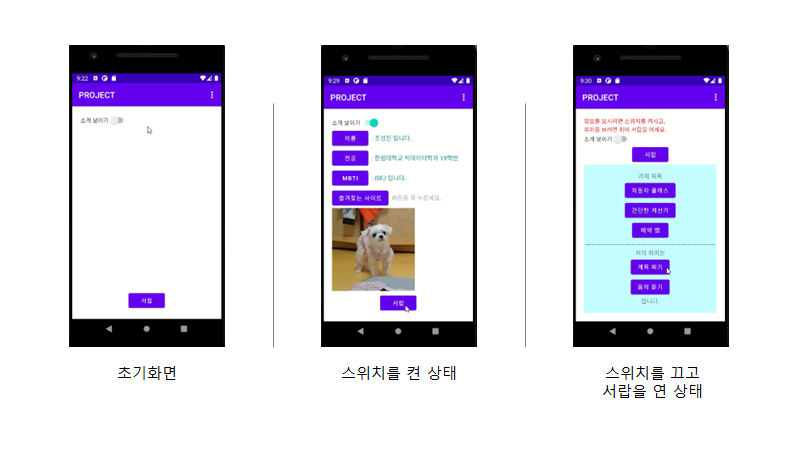
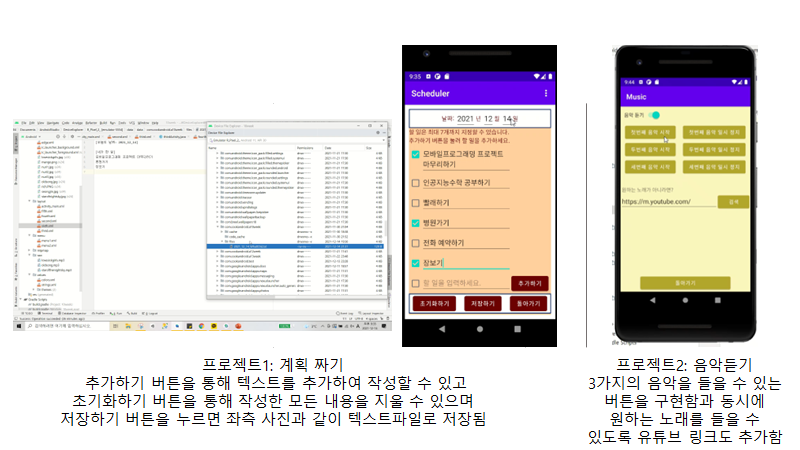

# To-Do-List
'모바일 프로그래밍' 과목 프로젝트 (java)

### Introduce
* 주제: 나에게 꼭 필요한 투두리스트와 음악듣기
* 본인 프로필이 들어간 내용과 더불어 자유 주제로 프로젝트를 작성

### skills
* UI 설계: xml 
* 기능 구현: java

### User Interface
* just Click or touch
  
### Improvement points
* 버튼의 모양이나 글씨체를 바꾸는 등 디자인 고급화
* 스크롤을 적극 활용하여 컨텐츠 풍부화

### Images

